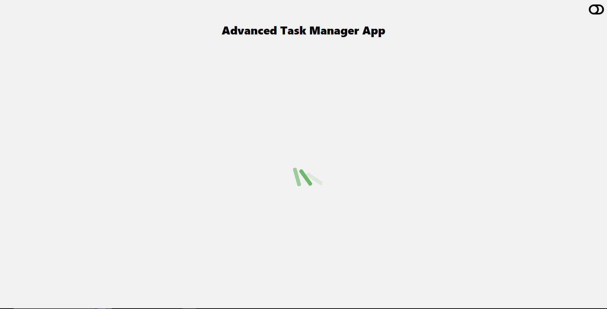

# 🧠 Advanced Task Manager App

A full-stack **MERN Task Manager Application** with modern UI and seamless UX.  
This app allows users to **Create, Read, Update, Delete (CRUD)** tasks with additional features like drag-and-drop ordering, toast notifications, loading states, error validation, and more.

---

## 🚀 Tech Stack

### 🖥️ Frontend
- **React + Vite**
- **TanStack Query (React Query)** – server state management & API caching
- **React Beautiful DnD** – drag & drop for task reordering
- **React Toastify** – stylish toast notifications
- **Axios** – API requests
- **CSS** – custom styling

### 🗄️ Backend
- **Node.js + Express.js**
- **MongoDB + Mongoose**
- **REST API**

---

## ✨ Features

✅ Add new task  
✅ Update / edit task  
✅ Delete task  
✅ Mark task as completed  
✅ Drag & drop task reordering  
✅ Real-time UI updates using TanStack Query  
✅ Toast notifications (success / error)  
✅ Loading indicators for API calls  
✅ Validation – prevents empty input fields  
✅ Centralized error handling  
✅ Clean UI & responsive layout  

---

## 📂 Project Structure (Frontend)

Frontend/
│── api/
│ └── taskApi.js
│── src/
│ ├── assets/
│ │ └── react.svg
│ ├── components/
│ │ ├── taskUpdateModal.jsx
│ │ └── taskView.jsx
│ ├── style/
│ │ └── index.css
│ ├── App.jsx
│ ├── main.jsx
│── public/
│── index.html
│── vite.config.js
│── package.json

---

## ⚙️ Installation & Setup
Frontend

cd Frontend
npm install

